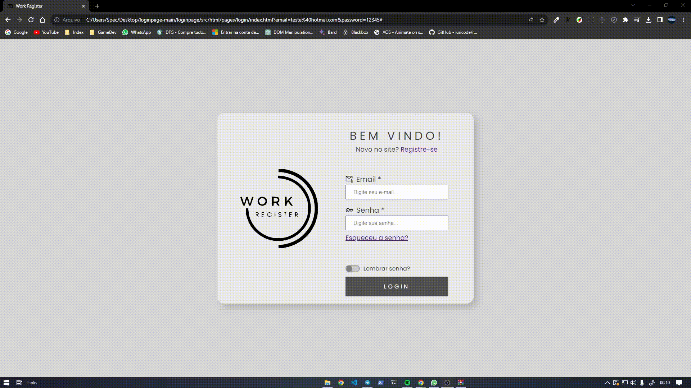

<p align="center"></p>

<div align="center">
	<h3 align="center">Login Page</h3>
	<p align="center">Project of a responsive login page created with a significant amount of CSS and HTML in its functionalities.</p>
</div>
<h3  align="center">
		✅ Status: Completed ✅
</h3>
<div align="center">
<a href="#">Access the application by clicking here!</a>
</div>

## 🗒️ Content

- [About](#-About)
- [Demonstration](#-Demonstration)
- [Technologies](#-Technologies)
- [Prerequisites](#-Prerequisites)
- [How to run?](#-Rodando-a-aplicação)
- [Author](#-Author)

## 📖 About
Project developed through personal ideas and studies. A project consisting of a responsive login page with a fictional brand where the user can either create an account or log in. The login and account creation functions are only aesthetic, as the project is not connected to a database.

## 📺 Demonstration

<p align="center">
  
</p>

## 🛠 Technologies

The following tools were used in the construction of the project:

- [HTML](https://developer.mozilla.org/pt-BR/docs/Web/HTML)
- [CSS](https://developer.mozilla.org/pt-BR/docs/Web/CSS)

## ⚠️ Prerequisites

Before you begin, you will need to have the following tools installed on your machine:

- [VSCode](https://code.visualstudio.com/)
- [Git](https://git-scm.com)
- [NPM](https://www.npmjs.com)


## 🔥 Running the application

```bash
# Download this repository

# Access the project folder in vscode:

# Run the index.html file with LiveServer through vscode
# or open the index.html file in your browser

# The application will start locally on your machine!
```

<!-- AUTHOR -->

## 🤓 Author

<div align="center" >
<a href="https://www.linkedin.com/in/leonisantos/">
 
 <br />
 <b>Leôni Santos</b></a> <a href="https://www.linkedin.com/in/leonisantos/" title="Linkedin">🚀
</a>
 <br />
 <br />
Made with ❤️ by Leôni Santos 👋🏽 Get in touch!

</div>

## 📕License

This project is under the [MIT](./LICENSE).
